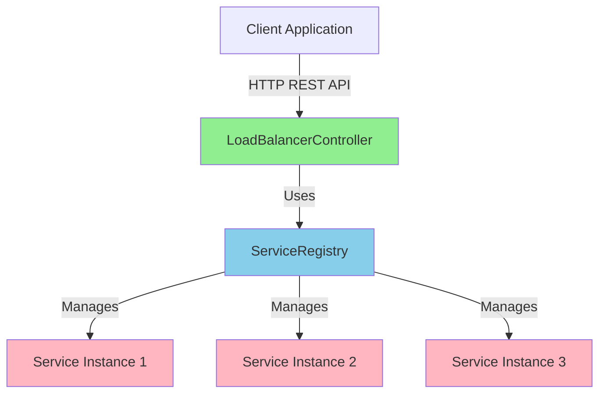
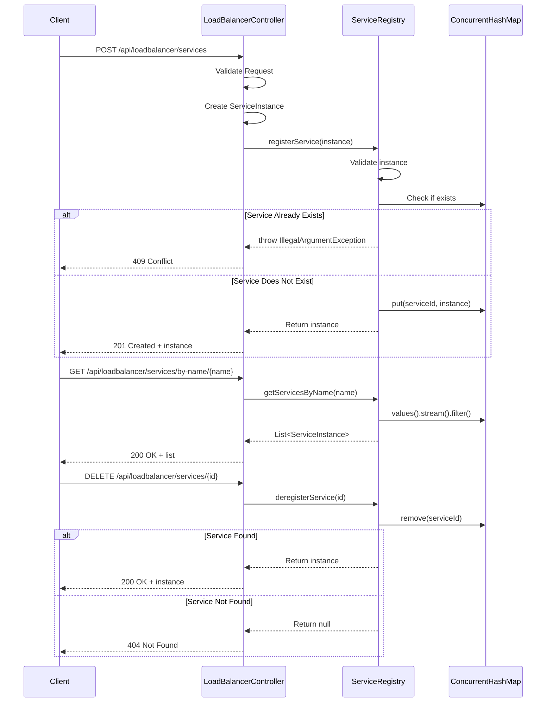
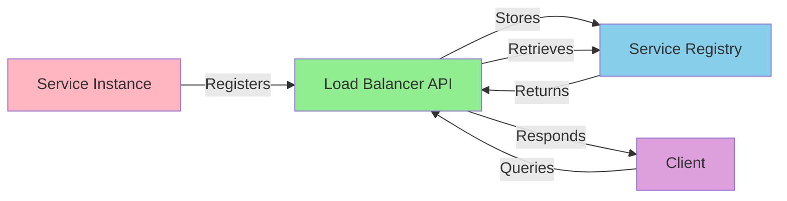
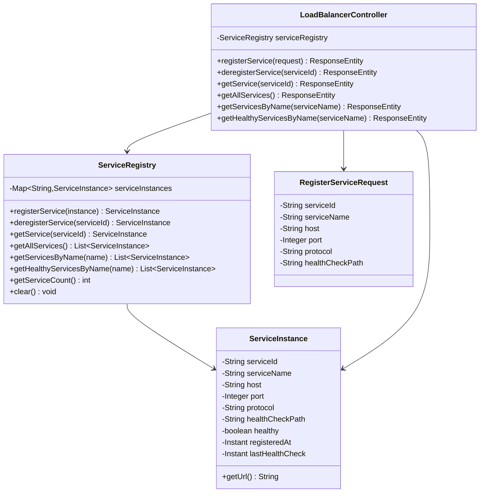

# Load Balancer - Design Document

## Overview

This document describes the design and implementation of a simple Load Balancer service registry with REST API. The load balancer allows services to register themselves and provides an API for service discovery.

## Architecture

The load balancer is built using Spring Boot and follows a layered architecture:

1. **Controller Layer**: REST API endpoints for service management
2. **Service Layer**: Business logic for service registration and discovery
3. **Model Layer**: Data models representing service instances

### Components

#### 1. ServiceInstance (Model)
Represents a registered service instance with the following properties:
- `serviceId`: Unique identifier for the service instance
- `serviceName`: Name of the service (multiple instances can share the same name)
- `host`: Hostname or IP address where the service is running
- `port`: Port number on which the service is listening
- `protocol`: Communication protocol (http/https)
- `healthCheckPath`: Path for health check endpoint
- `healthy`: Current health status of the service
- `registeredAt`: Timestamp when the service was registered
- `lastHealthCheck`: Timestamp of the last health check

#### 2. ServiceRegistry (Service)
The core component that manages service instances:
- Maintains a thread-safe registry of service instances using `ConcurrentHashMap`
- Provides operations for:
  - Registering new service instances
  - Deregistering service instances
  - Retrieving service instances by ID
  - Getting all instances of a service by name
  - Filtering healthy service instances

#### 3. LoadBalancerController (Controller)
REST API controller providing HTTP endpoints:
- `POST /api/loadbalancer/services` - Register a new service
- `DELETE /api/loadbalancer/services/{serviceId}` - Deregister a service
- `GET /api/loadbalancer/services/{serviceId}` - Get a specific service instance
- `GET /api/loadbalancer/services` - Get all registered services
- `GET /api/loadbalancer/services/by-name/{serviceName}` - Get all instances of a service
- `GET /api/loadbalancer/services/by-name/{serviceName}/healthy` - Get healthy instances of a service

## API Design

### Register Service
```http
POST /api/loadbalancer/services
Content-Type: application/json

{
  "serviceId": "service-1",
  "serviceName": "user-service",
  "host": "localhost",
  "port": 8081,
  "protocol": "http",
  "healthCheckPath": "/health"
}
```

**Response** (201 Created):
```json
{
  "serviceId": "service-1",
  "serviceName": "user-service",
  "host": "localhost",
  "port": 8081,
  "protocol": "http",
  "healthCheckPath": "/health",
  "healthy": true,
  "registeredAt": "2025-11-18T19:30:00Z",
  "lastHealthCheck": null
}
```

### Deregister Service
```http
DELETE /api/loadbalancer/services/service-1
```

**Response** (200 OK):
```json
{
  "serviceId": "service-1",
  "serviceName": "user-service",
  ...
}
```

### Get Service by ID
```http
GET /api/loadbalancer/services/service-1
```

**Response** (200 OK):
```json
{
  "serviceId": "service-1",
  "serviceName": "user-service",
  ...
}
```

### Get All Services
```http
GET /api/loadbalancer/services
```

**Response** (200 OK):
```json
[
  {
    "serviceId": "service-1",
    "serviceName": "user-service",
    ...
  },
  {
    "serviceId": "service-2",
    "serviceName": "order-service",
    ...
  }
]
```

### Get Services by Name
```http
GET /api/loadbalancer/services/by-name/user-service
```

**Response** (200 OK):
```json
[
  {
    "serviceId": "service-1",
    "serviceName": "user-service",
    ...
  },
  {
    "serviceId": "service-3",
    "serviceName": "user-service",
    ...
  }
]
```

### Get Healthy Services by Name
```http
GET /api/loadbalancer/services/by-name/user-service/healthy
```

**Response** (200 OK):
```json
[
  {
    "serviceId": "service-1",
    "serviceName": "user-service",
    "healthy": true,
    ...
  }
]
```

## Architecture Diagram



## Component Interaction Diagram



## Data Flow Diagram



## Class Diagram



## Implementation Details

### Thread Safety
The `ServiceRegistry` uses `ConcurrentHashMap` to ensure thread-safe operations when multiple services register/deregister concurrently.

### Validation
- All REST endpoints use Jakarta Bean Validation annotations
- Controller validates incoming requests before processing
- Service layer performs business logic validation

### Error Handling
The API returns appropriate HTTP status codes:
- `201 Created` - Successful service registration
- `200 OK` - Successful retrieval/deregistration
- `404 Not Found` - Service not found
- `409 Conflict` - Duplicate service ID
- `400 Bad Request` - Invalid request data

## Testing Strategy

### Unit Tests
- **ServiceRegistryTest**: Tests the core service registry logic
  - Service registration and deregistration
  - Service retrieval and filtering
  - Error handling for edge cases

### Integration Tests
- **LoadBalancerControllerTest**: Tests the REST API endpoints
  - HTTP request/response validation
  - End-to-end workflow testing
  - Error response validation

## Build and Run

### Build the project
```bash
cd packages/java-exercise
mvn clean install
```

### Run tests
```bash
mvn test
```

### Run the application
```bash
mvn spring-boot:run
```

The application will start on port 8080.

## Future Enhancements

1. **Load Balancing Algorithms**: Implement round-robin, least connections, or weighted algorithms
2. **Health Checks**: Active health checking of registered services
3. **Service Discovery**: Auto-discovery of services in cloud environments
4. **Metrics**: Expose metrics for monitoring and observability
5. **Persistence**: Store service registry in a database for persistence
6. **Service Metadata**: Support for tags, version information, and custom metadata
7. **API Gateway Integration**: Reverse proxy functionality for request routing
8. **Circuit Breaker**: Implement circuit breaker pattern for failing services
