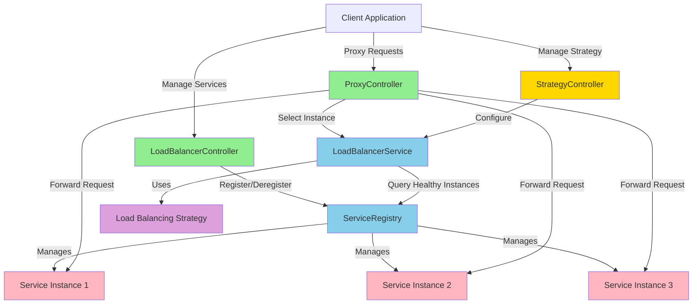
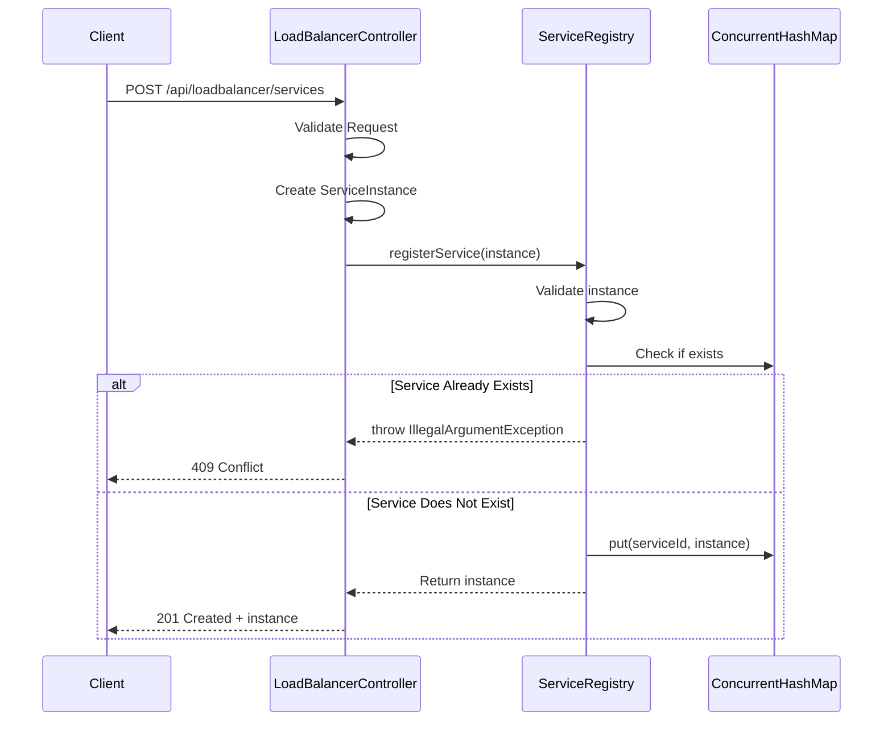
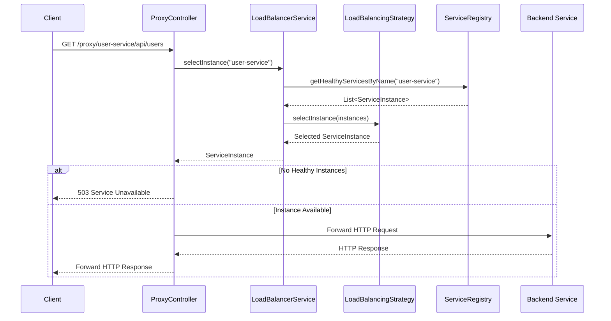
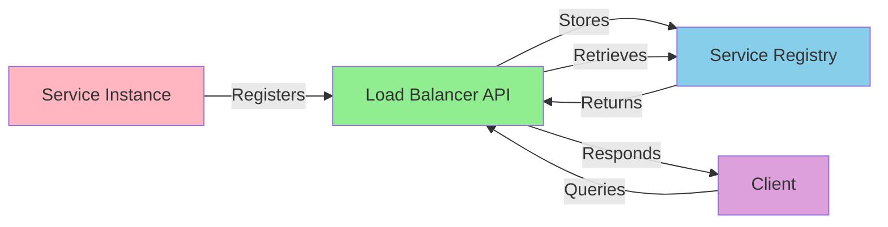
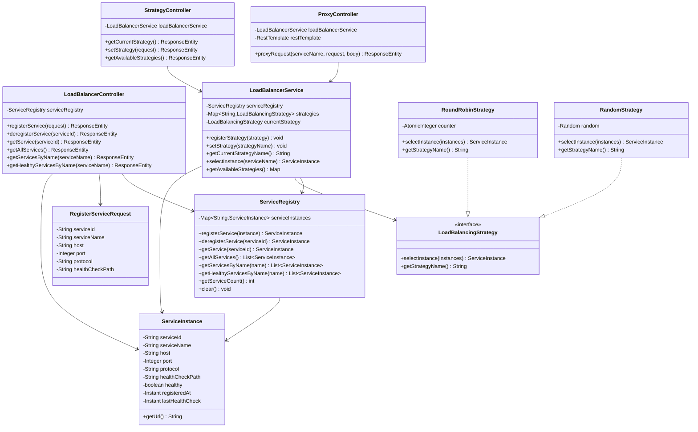

# Load Balancer - Design Document

## Overview

This document describes the design and implementation of a complete Load Balancer with service registry, REST API, and request proxying capabilities. The load balancer allows services to register themselves, provides an API for service discovery, and implements actual load balancing by distributing incoming requests across registered service instances using configurable strategies.

## Architecture

The load balancer is built using Spring Boot and follows a layered architecture:

1. **Controller Layer**: REST API endpoints for service management and request proxying
2. **Service Layer**: Business logic for service registration, discovery, and load balancing
3. **Strategy Layer**: Pluggable load balancing algorithms
4. **Model Layer**: Data models representing service instances

### Components

#### 1. ServiceInstance (Model)
Represents a registered service instance with the following properties:
- `serviceId`: Unique identifier for the service instance
- `serviceName`: Name of the service (multiple instances can share the same name)
- `host`: Hostname or IP address where the service is running
- `port`: Port number on which the service is listening
- `protocol`: Communication protocol (http/https)
- `healthCheckPath`: Path for health check endpoint
- `healthy`: Current health status of the service
- `registeredAt`: Timestamp when the service was registered
- `lastHealthCheck`: Timestamp of the last health check

#### 2. ServiceRegistry (Service)
The core component that manages service instances:
- Maintains a thread-safe registry of service instances using `ConcurrentHashMap`
- Provides operations for:
  - Registering new service instances
  - Deregistering service instances
  - Retrieving service instances by ID
  - Getting all instances of a service by name
  - Filtering healthy service instances

#### 3. LoadBalancerService (Service)
The main load balancing service that:
- Manages load balancing strategies
- Selects service instances based on the active strategy
- Supports multiple strategies: Round Robin, Random, etc.
- Only distributes requests to healthy service instances

#### 4. Load Balancing Strategies
Implements the Strategy pattern for different load balancing algorithms:

**LoadBalancingStrategy Interface**
- Defines the contract for all load balancing strategies
- `selectInstance(List<ServiceInstance>)` - Selects an instance from available instances

**RoundRobinStrategy**
- Distributes requests evenly across all instances
- Uses atomic counter for thread-safe operation
- Ensures fair distribution over time

**RandomStrategy**
- Randomly selects an instance from available instances
- Provides simple yet effective distribution
- No state tracking required

#### 5. LoadBalancerController (Controller)
REST API controller for service management:
- `POST /api/loadbalancer/services` - Register a new service
- `DELETE /api/loadbalancer/services/{serviceId}` - Deregister a service
- `GET /api/loadbalancer/services/{serviceId}` - Get a specific service instance
- `GET /api/loadbalancer/services` - Get all registered services
- `GET /api/loadbalancer/services/by-name/{serviceName}` - Get all instances of a service
- `GET /api/loadbalancer/services/by-name/{serviceName}/healthy` - Get healthy instances of a service

#### 6. StrategyController (Controller)
REST API controller for managing load balancing strategies:
- `GET /api/loadbalancer/strategy` - Get current strategy
- `PUT /api/loadbalancer/strategy` - Set load balancing strategy
- `GET /api/loadbalancer/strategy/available` - Get all available strategies

#### 7. ProxyController (Controller)
Reverse proxy controller that forwards requests to backend services:
- `/{method} /proxy/{serviceName}/**` - Proxy requests to backend services
- Automatically selects instances using the configured load balancing strategy
- Forwards HTTP method, headers, body, and query parameters
- Returns appropriate error codes (503 if no healthy instances available)

## API Design

### Register Service
```http
POST /api/loadbalancer/services
Content-Type: application/json

{
  "serviceId": "service-1",
  "serviceName": "user-service",
  "host": "localhost",
  "port": 8081,
  "protocol": "http",
  "healthCheckPath": "/health"
}
```

**Response** (201 Created):
```json
{
  "serviceId": "service-1",
  "serviceName": "user-service",
  "host": "localhost",
  "port": 8081,
  "protocol": "http",
  "healthCheckPath": "/health",
  "healthy": true,
  "registeredAt": "2025-11-18T19:30:00Z",
  "lastHealthCheck": null
}
```

### Deregister Service
```http
DELETE /api/loadbalancer/services/service-1
```

**Response** (200 OK):
```json
{
  "serviceId": "service-1",
  "serviceName": "user-service",
  ...
}
```

### Get Service by ID
```http
GET /api/loadbalancer/services/service-1
```

**Response** (200 OK):
```json
{
  "serviceId": "service-1",
  "serviceName": "user-service",
  ...
}
```

### Get All Services
```http
GET /api/loadbalancer/services
```

**Response** (200 OK):
```json
[
  {
    "serviceId": "service-1",
    "serviceName": "user-service",
    ...
  },
  {
    "serviceId": "service-2",
    "serviceName": "order-service",
    ...
  }
]
```

### Get Services by Name
```http
GET /api/loadbalancer/services/by-name/user-service
```

**Response** (200 OK):
```json
[
  {
    "serviceId": "service-1",
    "serviceName": "user-service",
    ...
  },
  {
    "serviceId": "service-3",
    "serviceName": "user-service",
    ...
  }
]
```

### Get Healthy Services by Name
```http
GET /api/loadbalancer/services/by-name/user-service/healthy
```

**Response** (200 OK):
```json
[
  {
    "serviceId": "service-1",
    "serviceName": "user-service",
    "healthy": true,
    ...
  }
]
```

## Load Balancing API

### Get Current Strategy
```http
GET /api/loadbalancer/strategy
```

**Response** (200 OK):
```json
{
  "strategy": "ROUND_ROBIN"
}
```

### Set Load Balancing Strategy
```http
PUT /api/loadbalancer/strategy
Content-Type: application/json

{
  "strategy": "ROUND_ROBIN"
}
```

**Response** (200 OK):
```json
{
  "strategy": "ROUND_ROBIN",
  "message": "Strategy updated successfully"
}
```

### Get Available Strategies
```http
GET /api/loadbalancer/strategy/available
```

**Response** (200 OK):
```json
{
  "strategies": ["RANDOM", "ROUND_ROBIN"],
  "current": "ROUND_ROBIN"
}
```

### Proxy Request to Backend Service
```http
GET /proxy/user-service/api/users
```

This will:
1. Select a healthy instance of "user-service" using the current load balancing strategy
2. Forward the request to the selected instance
3. Return the response from the backend service

**Response**: Forwards the response from the backend service

**Error Response** (503 Service Unavailable):
```json
{
  "error": "No healthy instances available for service: user-service"
}
```

## Architecture Diagram



## Component Interaction Diagram

### Service Registration Flow


### Load Balanced Request Flow


## Data Flow Diagram



## Class Diagram



## Implementation Details

### Load Balancing Strategies
The system implements the Strategy pattern for load balancing:
- **Interface**: `LoadBalancingStrategy` defines the contract
- **Round Robin**: Distributes requests evenly using an atomic counter
- **Random**: Randomly selects instances for simple distribution
- **Extensible**: New strategies can be easily added by implementing the interface

### Thread Safety
- `ServiceRegistry` uses `ConcurrentHashMap` for thread-safe concurrent operations
- `RoundRobinStrategy` uses `AtomicInteger` for thread-safe counter increments
- All components are designed for concurrent access

### Request Proxying
- `ProxyController` forwards all HTTP methods (GET, POST, PUT, DELETE, PATCH)
- Headers are copied (except Host and Content-Length)
- Query parameters and request body are forwarded
- Response headers and body are returned to the client
- Proper error handling for backend failures

### Validation
- All REST endpoints use Jakarta Bean Validation annotations
- Controller validates incoming requests before processing
- Service layer performs business logic validation

### Error Handling
The API returns appropriate HTTP status codes:
- `201 Created` - Successful service registration
- `200 OK` - Successful retrieval/deregistration/strategy update
- `404 Not Found` - Service not found
- `409 Conflict` - Duplicate service ID
- `400 Bad Request` - Invalid request data
- `503 Service Unavailable` - No healthy instances for proxying
- `502 Bad Gateway` - Error forwarding request to backend

## Testing Strategy

### Unit Tests
- **ServiceRegistryTest** (11 tests): Core service registry logic
  - Service registration and deregistration
  - Service retrieval and filtering
  - Error handling for edge cases

- **LoadBalancerServiceTest** (9 tests): Load balancing service logic
  - Strategy registration and switching
  - Instance selection using different strategies
  - Health-based filtering

- **RoundRobinStrategyTest** (6 tests): Round-robin algorithm
  - Distribution across instances
  - Edge cases (empty, null, single instance)

- **RandomStrategyTest** (6 tests): Random selection algorithm
  - Random distribution validation
  - Edge cases handling

### Integration Tests
- **LoadBalancerControllerTest** (10 tests): Service management REST API
  - HTTP request/response validation
  - End-to-end workflow testing
  - Error response validation

- **StrategyControllerTest** (6 tests): Strategy management REST API
  - Strategy retrieval and switching
  - Available strategies listing
  - Error handling

**Total: 48 tests, all passing**

## Build and Run

### Build the project
```bash
cd packages/java-exercise
mvn clean install
```

### Run tests
```bash
mvn test
```

### Run the application
```bash
mvn spring-boot:run
```

The application will start on port 8080.

## Future Enhancements

1. **Additional Load Balancing Algorithms**: 
   - Least connections
   - Weighted round-robin
   - IP hash
   - Least response time

2. **Health Checks**: Active health checking of registered services
3. **Service Discovery**: Auto-discovery of services in cloud environments
4. **Metrics**: Expose metrics for monitoring and observability
5. **Persistence**: Store service registry in a database for persistence
6. **Service Metadata**: Support for tags, version information, and custom metadata
7. **Circuit Breaker**: Implement circuit breaker pattern for failing services
8. **Rate Limiting**: Request rate limiting per service
9. **SSL/TLS Support**: Secure communication with backend services
10. **WebSocket Support**: Load balance WebSocket connections
