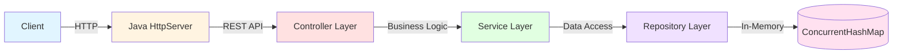
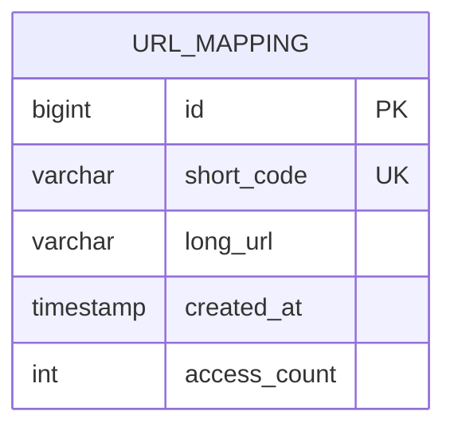
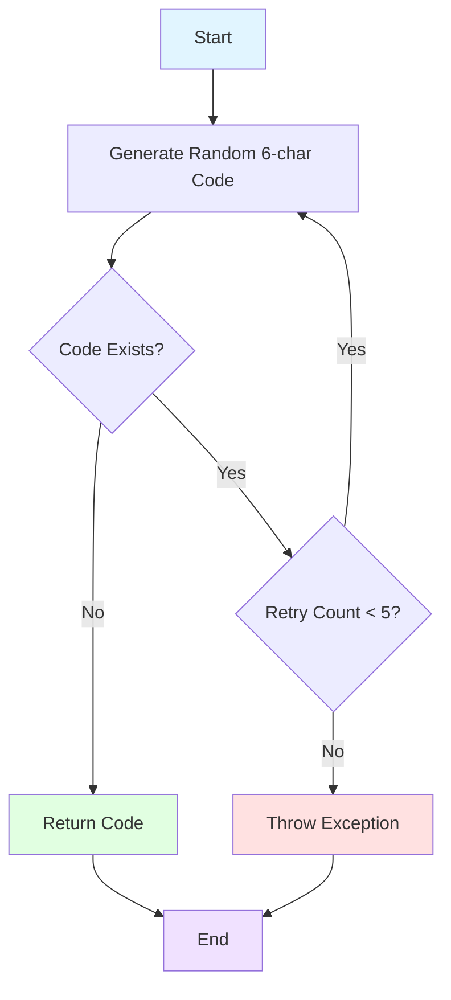
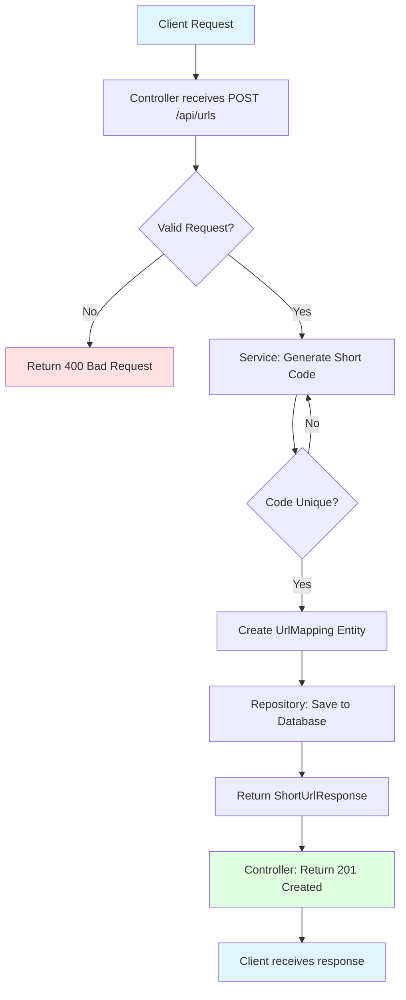
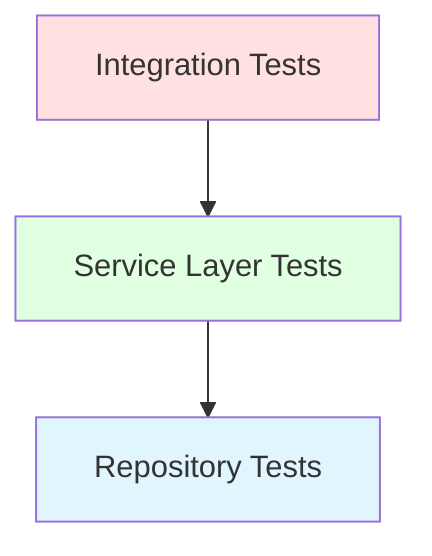

# URL Shortener - System Design Document

## 1. Executive Summary

This document describes the design and architecture of a URL shortener REST API service built using **core Java** (no frameworks) and Test-Driven Development (TDD) practices. The service provides a simple, efficient way to create and manage shortened URLs using only the Java standard library.

## 2. System Overview

### 2.1 Purpose

The URL shortener service allows users to:
- Convert long URLs into short, manageable links
- Redirect users from short URLs to original destinations
- Track basic analytics (access count)

### 2.2 Scope

**In Scope**:
- REST API endpoints for URL shortening
- URL validation
- Short code generation
- Redirect functionality
- Basic analytics (access count)
- In-memory persistence

**Out of Scope**:
- User authentication/authorization
- Custom vanity URLs
- URL expiration
- Advanced analytics
- Rate limiting
- Distributed deployment

## 3. Architecture

### 3.1 High-Level Architecture



### 3.2 Component Description

#### 3.2.1 Controller Layer
- **Responsibility**: Handle HTTP requests and responses
- **Components**: `UrlController`
- **Functions**:
  - Receive and validate API requests
  - Delegate to service layer
  - Format responses
  - Handle HTTP status codes

#### 3.2.2 Service Layer
- **Responsibility**: Business logic and URL shortening algorithm
- **Components**: `UrlShortenerService`
- **Functions**:
  - Generate unique short codes
  - Validate URLs
  - Coordinate between controller and repository
  - Update access statistics

#### 3.2.3 Repository Layer
- **Responsibility**: Data persistence
- **Components**: `UrlRepository`
- **Functions**:
  - CRUD operations on URL mappings
  - Query by short code
  - Check for code uniqueness

#### 3.2.4 Model Layer
- **Responsibility**: Domain entities
- **Components**: `UrlMapping`
- **Functions**:
  - Represent URL mapping data
  - JPA entity annotations

#### 3.2.5 DTO Layer
- **Responsibility**: Data transfer objects
- **Components**: `CreateShortUrlRequest`, `ShortUrlResponse`, `UrlInfoResponse`
- **Functions**:
  - Decouple API contract from domain model
  - Validation annotations

## 4. Data Model

### 4.1 Entity Relationship Diagram



### 4.2 UrlMapping Entity

| Field | Type | Constraints | Description |
|-------|------|-------------|-------------|
| id | Long | Primary Key, Auto-increment | Unique identifier |
| shortCode | String | Unique, Not Null, Length=6 | Generated short code |
| longUrl | String | Not Null, Max=2048 | Original URL |
| createdAt | LocalDateTime | Not Null | Creation timestamp |
| accessCount | int | Default=0 | Number of times accessed |

## 5. API Design

### 5.1 REST Endpoints

#### Create Short URL
```
POST /api/urls
Content-Type: application/json

Request:
{
  "longUrl": "https://example.com/long/url"
}

Response: 201 Created
{
  "shortCode": "abc123",
  "shortUrl": "http://localhost:8080/abc123",
  "longUrl": "https://example.com/long/url"
}
```

#### Redirect to Original URL
```
GET /{shortCode}

Response: 302 Found
Location: https://example.com/long/url
```

#### Get URL Information
```
GET /api/urls/{shortCode}

Response: 200 OK
{
  "shortCode": "abc123",
  "longUrl": "https://example.com/long/url",
  "createdAt": "2024-01-15T10:30:00",
  "accessCount": 42
}
```

### 5.2 Error Responses

| Status Code | Description | Example |
|-------------|-------------|---------|
| 400 Bad Request | Invalid URL format | Missing or malformed URL |
| 404 Not Found | Short code not found | Non-existent short code |
| 500 Internal Server Error | Server error | Unexpected failures |

## 6. Algorithm Design

### 6.1 Short Code Generation



**Algorithm**:
1. Generate random 6-character alphanumeric string (Base62: a-z, A-Z, 0-9)
2. Check if code already exists in database
3. If exists, retry up to 5 times
4. If all retries fail, throw exception
5. Return unique code

**Characteristics**:
- Character set: 62 characters (a-z, A-Z, 0-9)
- Length: 6 characters
- Possible combinations: 62^6 = ~56.8 billion
- Collision probability: Very low for reasonable scale

### 6.2 URL Validation

- Check if URL is not null or empty
- Validate URL format using regex or URL parser
- Ensure protocol is present (http/https)
- Maximum URL length: 2048 characters

## 7. Flow Diagrams

### 7.1 Create Short URL Flow



### 7.2 Redirect Flow

```mermaid
flowchart TD
    A[Client Request] --> B[Controller receives GET /{shortCode}]
    B --> C[Service: Find by Short Code]
    C --> D{Mapping Exists?}
    D -->|No| E[Return 404 Not Found]
    D -->|Yes| F[Increment Access Count]
    F --> G[Repository: Update Mapping]
    G --> H[Return Original URL]
    H --> I[Controller: Return 302 Redirect]
    I --> J[Client redirected to Original URL]
    
    style A fill:#e1f5ff
    style E fill:#ffe1e1
    style I fill:#e1ffe1
    style J fill:#e1f5ff
```

## 8. Technology Stack

| Layer | Technology | Version | Purpose |
|-------|-----------|---------|---------|
| Language | Java | 17 | Programming language |
| HTTP Server | com.sun.net.httpserver.HttpServer | Built-in | REST API server |
| JSON | Gson | 2.10.1 | JSON serialization |
| Storage | ConcurrentHashMap | Built-in | Thread-safe in-memory storage |
| Build | Maven | 3.6+ | Dependency management |
| Testing | JUnit 5 | 5.10.x | Unit testing |
| HTTP Client | Java HttpClient | Built-in | Integration testing |

## 9. Security Considerations

### 9.1 Current Implementation
- Input validation to prevent injection attacks
- URL validation to prevent malicious URLs
- Limited scope (no authentication required)

### 9.2 Future Enhancements
- Rate limiting to prevent abuse
- HTTPS enforcement
- URL blacklist/whitelist
- CAPTCHA for public endpoints
- API authentication

## 10. Performance Considerations

### 10.1 Current Design
- In-memory database (H2) for fast access
- Simple short code generation algorithm
- Indexed short_code column for quick lookups

### 10.2 Scalability
For production scale:
- Replace H2 with PostgreSQL/MySQL
- Add caching layer (Redis)
- Database connection pooling
- Horizontal scaling with load balancer
- Distributed short code generation

## 11. Testing Strategy

### 11.1 Test Pyramid



### 11.2 Test Coverage

| Layer | Test Type | Coverage |
|-------|-----------|----------|
| Controller | Integration Tests | API endpoints, HTTP status codes |
| Service | Unit Tests | Business logic, edge cases |
| Repository | Unit Tests | Data access operations |

### 11.3 TDD Approach

1. Write failing test
2. Implement minimum code to pass
3. Refactor
4. Repeat

## 12. Deployment

### 12.1 Build and Run

```bash
# Build
mvn clean install

# Run
mvn spring-boot:run

# Run tests
mvn test
```

### 12.2 Configuration

Application properties located in `src/main/resources/application.properties`:
- Server port
- Database configuration
- Logging levels

## 13. Monitoring and Maintenance

### 13.1 Current Implementation
- Basic logging with SLF4J
- Spring Boot Actuator (optional)

### 13.2 Future Enhancements
- Application metrics
- Performance monitoring
- Error tracking
- Health checks

## 14. Future Roadmap

1. **Phase 1** (Current): Basic URL shortening with REST API
2. **Phase 2**: Custom short codes, URL expiration
3. **Phase 3**: User authentication, analytics dashboard
4. **Phase 4**: Advanced features (QR codes, link tracking)

## 15. Assumptions and Constraints

### Assumptions
- English alphanumeric characters only
- No user authentication required
- Single instance deployment
- Moderate traffic volume

### Constraints
- 6-character short code limit
- 2048-character URL length limit
- In-memory database (data loss on restart)
- No custom domain support

## 16. Glossary

- **Short Code**: The unique identifier used in the shortened URL
- **Long URL**: The original URL to be shortened
- **URL Mapping**: The association between short code and long URL
- **TDD**: Test-Driven Development
- **REST**: Representational State Transfer
- **JPA**: Java Persistence API
