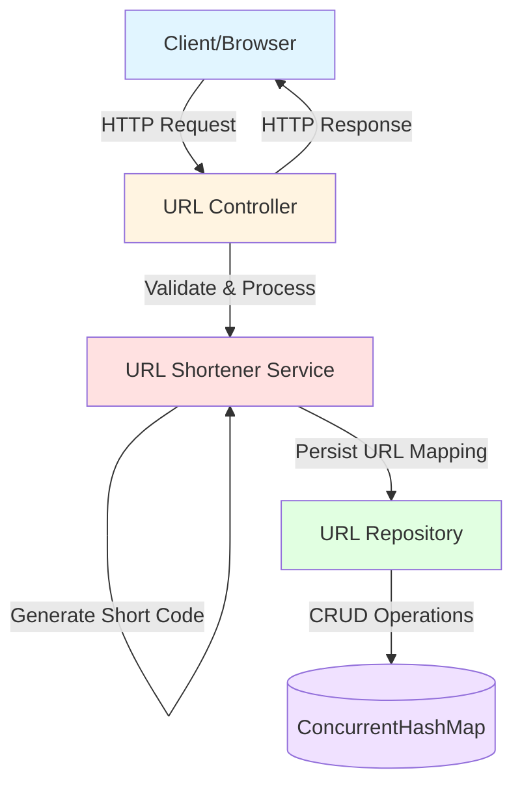
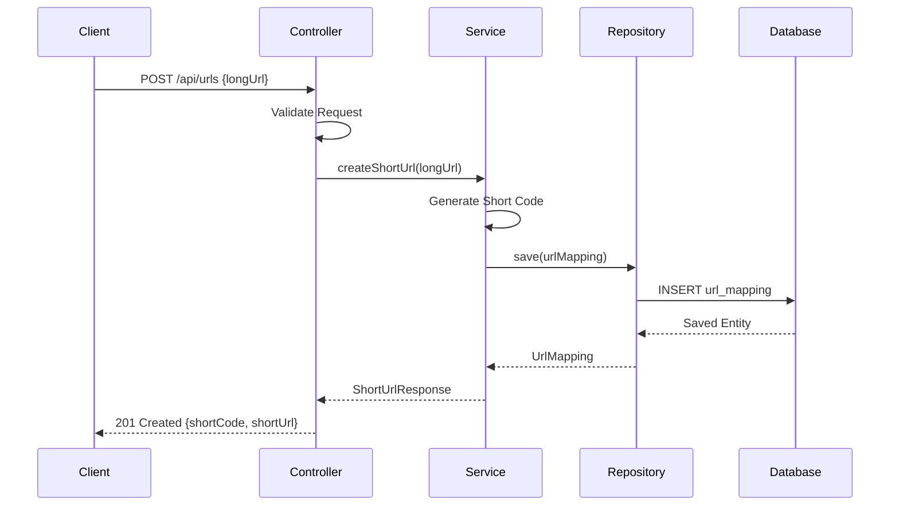
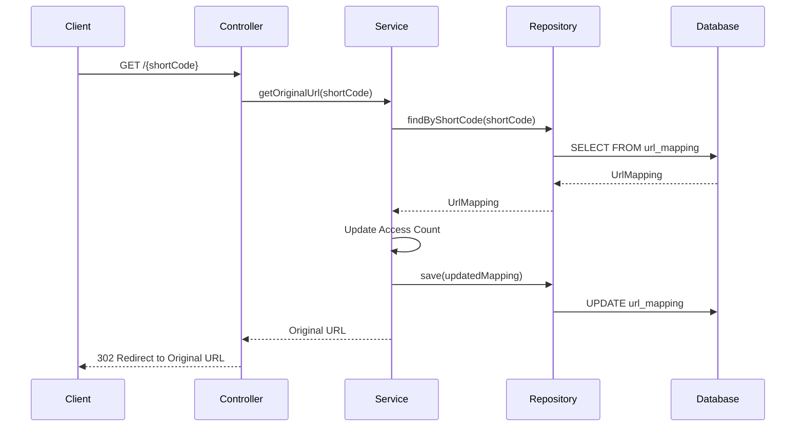
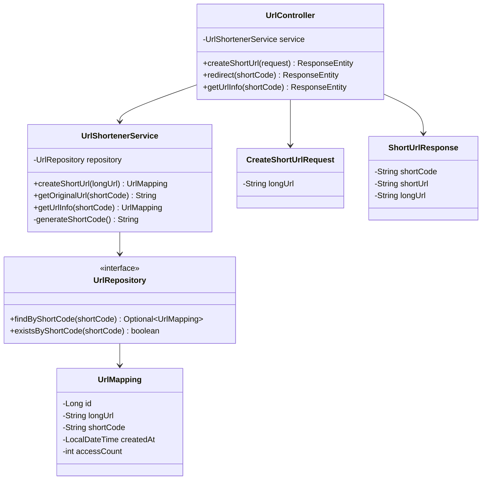

# URL Shortener REST API

A Test-Driven Development (TDD) implementation of a URL shortener service with REST API endpoints.

## Overview

This is a REST API implementation of a URL shortener service built using **core Java only** (no frameworks) and following TDD practices. The service uses Java's built-in `HttpServer` for REST API endpoints and in-memory storage. This demonstrates building a production-quality REST API using only the Java standard library.

## Features

- **Create Short URL**: Generate a short URL from a long URL
- **Retrieve Original URL**: Get the original URL from a short code
- **Redirect**: Automatically redirect from short URL to original URL
- **URL Validation**: Validate URLs before shortening
- **In-Memory Storage**: Uses ConcurrentHashMap for thread-safe persistence
- **No External Frameworks**: Built with core Java only

## Architecture

### System Components

The URL shortener follows a layered architecture:

1. **Controller Layer**: REST API endpoints
2. **Service Layer**: Business logic and URL shortening algorithm
3. **Repository Layer**: Data persistence
4. **Model Layer**: Domain entities
5. **DTO Layer**: Data transfer objects for API requests/responses

### System Design



### Sequence Diagram - Create Short URL



### Sequence Diagram - Redirect to Original URL



### Class Diagram



## API Endpoints

### 1. Create Short URL

**Endpoint**: `POST /api/urls`

**Request Body**:
```json
{
  "longUrl": "https://www.example.com/very/long/url/path"
}
```

**Response**: `201 Created`
```json
{
  "shortCode": "abc123",
  "shortUrl": "http://localhost:8080/abc123",
  "longUrl": "https://www.example.com/very/long/url/path"
}
```

### 2. Redirect to Original URL

**Endpoint**: `GET /{shortCode}`

**Response**: `302 Found`
- Redirects to the original URL

### 3. Get URL Information

**Endpoint**: `GET /api/urls/{shortCode}`

**Response**: `200 OK`
```json
{
  "shortCode": "abc123",
  "longUrl": "https://www.example.com/very/long/url/path",
  "createdAt": "2024-01-15T10:30:00",
  "accessCount": 42
}
```

## Technology Stack

- **Java 17**: Programming language
- **com.sun.net.httpserver.HttpServer**: Built-in HTTP server for REST API
- **ConcurrentHashMap**: Thread-safe in-memory storage
- **Gson**: JSON serialization/deserialization
- **Maven**: Build tool
- **JUnit 5**: Testing framework
- **Java HttpClient**: For integration testing

## Prerequisites

- Java 17 or higher
- Maven 3.6+

## Setup and Installation

1. Navigate to the project directory:
```bash
cd packages/java-url-shortener
```

2. Build the project:
```bash
mvn clean install
```

3. Run the application:
```bash
java -cp target/classes:target/dependency/* com.tddplayground.urlshortener.UrlShortenerApplication
```

Or build an executable JAR:
```bash
mvn package
java -jar target/url-shortener-1.0.0-SNAPSHOT.jar
```

The API will be available at `http://localhost:8080`

## Running Tests

Run all tests:
```bash
mvn test
```

Run tests with coverage:
```bash
mvn test
```

All tests use plain JUnit 5 without any framework dependencies.

## Usage Examples

### Using cURL

Create a short URL:
```bash
curl -X POST http://localhost:8080/api/urls \
  -H "Content-Type: application/json" \
  -d '{"longUrl": "https://www.example.com/very/long/url"}'
```

Access a short URL (redirect):
```bash
curl -L http://localhost:8080/abc123
```

Get URL information:
```bash
curl http://localhost:8080/api/urls/abc123
```

## TDD Approach

This project was built following Test-Driven Development principles:

1. **Red**: Write failing tests first
2. **Green**: Implement minimum code to pass tests
3. **Refactor**: Improve code while keeping tests passing

### Test Coverage

- Unit tests for service layer logic
- Unit tests for repository operations
- Integration tests for REST API endpoints
- Edge case and error handling tests

## Design Decisions

### Short Code Generation

- Uses a random alphanumeric string (6 characters)
- Collision detection with retry mechanism
- Base62 encoding for URL-safe characters

### Storage

- **ConcurrentHashMap** for thread-safe in-memory storage
- **AtomicLong** for ID generation
- No database dependencies - pure Java
- Data is lost on restart (suitable for demonstration/testing)

### Error Handling

- Custom exceptions for different error scenarios
- Direct error handling in controller methods
- Proper HTTP status codes
- JSON error responses

### HTTP Server

- Uses Java's built-in `com.sun.net.httpserver.HttpServer`
- No external web framework dependencies
- Lightweight and fast startup
- Simple routing based on URL patterns

## Future Enhancements

- Custom short codes (vanity URLs)
- URL expiration
- Analytics and tracking
- User authentication
- Rate limiting
- Custom domain support
- Database migration to persistent storage

## License

MIT License - Part of the TDD Playground repository
